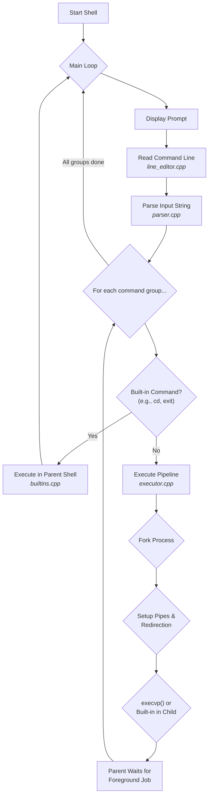

# FOOL : A POSIX-Compliant Shell

## Overview

FOOL is a custom interactive shell program written in C++ that emulates the core functionalities of a standard POSIX shell. It can parse user input, manage foreground and background processes, handle I/O redirection and pipelines, and provides advanced features like tab-completion and command history. The entire project is written in a modular fashion for clarity and maintainability.

-----

## Execution Flow
The following diagram illustrates the high-level execution flow of the shell, from reading user input to executing the command and displaying the next prompt.


-----

## Features Implemented

This shell supports a wide range of features as per the assignment requirements:

### 1\. Dynamic Shell Prompt

  * The shell displays a dynamic prompt in the format `username@system_name:current_directory$`.
  * The directory from which the shell is launched is treated as the home directory and is represented by `~`.
  * The prompt correctly reflects changes in the current working directory.

### 2\. Command Parsing & Execution

  * **Sequential Commands**: Supports a semicolon-separated list of commands.
  * **Background Processes**: Any command ending with `&` is executed as a background process, and its process ID is printed.
  * **System Commands**: Can execute any system command (like `vi`, `gedit`, etc.) in either the foreground or background.
  * **Robust Tokenizing**: Handles random spaces and tabs in user input appropriately.

### 3\. Built-in Commands

The following commands are implemented internally without using `execvp`:

  * `cd`: Changes the current directory. Supports `.` (current), `..` (parent), `~` (home), and `-` (previous) arguments. `cd` with no arguments changes to the home directory.
  * `pwd`: Prints the absolute path of the current working directory.
  * `echo`: Prints its arguments to standard output, handling spaces and tabs correctly.
  * `ls`: Lists directory contents. Supports `-l` (long format) and `-a` (show all files) flags, which can be combined (e.g., `ls -la`). It can also list specific files or directories.
  * `pinfo`: Displays process information, including process status, memory usage, and executable path for the shell itself (`pinfo`) or a given PID (`pinfo <pid>`).
  * `search`: Recursively searches for a file or folder in the current directory and prints `True` or `False`.
  * `history`: Displays the last 10 commands entered. `history <num>` displays the last `<num>` commands. The shell stores up to 20 commands, which persist across sessions.
  * `exit`: Terminates the shell session.

### 4\. I/O Redirection and Pipelines

  * **Redirection**: Supports input redirection (`<`), output redirection (`>`), and append output redirection (`>>`). Output files are created with permissions `0644` if they don't exist.
  * **Piping**: Supports chaining any number of commands together using pipes (`|`) to direct the output of one command to the input of the next.
  * **Combined Usage**: Handles I/O redirection within a pipeline of commands.

### 5\. Job Control and Signal Handling

  * `Ctrl+C`: Interrupts the current foreground process by sending it a `SIGINT` signal. It has no effect if no foreground process is running.
  * `Ctrl+Z`: Pushes the current foreground process into the background in a stopped state. It has no effect if no foreground process is running.
  * `Ctrl+D`: Logs out of the shell if the input line is empty.

### 6\. Advanced Line Editing Features

  * **Tab Autocomplete**: Provides command and file/directory completion when the `TAB` key is pressed.
      * Completes the word if there is a single match.
      * Completes the longest common prefix for multiple matches.
      * Displays all possible matches on a second `TAB` press.
  * **History Navigation**: Users can navigate through previous commands using the `Up Arrow` and `Down Arrow` keys. The retrieved command can be edited before execution.

-----

## Additional Features

Beyond the core requirements, this shell implements several quality-of-life improvements:

  * **`jobs` Command**: A built-in `jobs` command is provided to list all currently running background processes, along with their job number, state (Running/Stopped), command name, and PID.
  * **`clear` Command**: Includes a `clear` command to clear the terminal screen.
  * **Colored Output**: The shell prompt and the output of the `ls` command use ANSI color codes for enhanced readability, distinguishing between directories, executables, and regular files.
  * **Robust Quote Handling**: The custom parser correctly handles arguments enclosed in single (`'`) or double (`"`) quotes, allowing for filenames and arguments with spaces. This is a significant improvement over the suggested `strtok` method.
  * **Human-Readable `ls`**: The built-in `ls` command supports an additional `-h` flag, which, when used with `-l`, displays file sizes in a human-readable format (e.g., `4.0K`, `1.2M`, `2.0G`).

-----

## Code Structure

The project is organized into several modular files, each with a specific responsibility. All sources live in `src/`:

  * **`src/main.cpp`**: The entry point of the shell. It contains the main loop, initializes history and autocomplete caches, and sets up signal handlers.
  * **`src/parser.cpp`**: Responsible for tokenizing the raw input string into a structured sequence of commands, handling quotes, semicolons, pipes, and redirection.
  * **`src/executor.cpp`**: The execution engine. It takes parsed commands and manages forking, piping, I/O redirection, and running both built-in and system commands.
  * **`src/builtins.cpp`**: Contains the implementation for all built-in commands like `cd`, `ls`, `pinfo`, `history`, etc.
  * **`src/line_editor.cpp`**: Manages the interactive command-line interface. It enables raw terminal mode to handle keypresses for history navigation, tab completion, and signal shortcuts.
  * **`src/autocomplete.cpp`**: Implements the logic for tab completion for both system commands and local files/directories.
  * **`src/history.cpp`**: Manages the command history, including loading from and saving to a file to ensure persistence across sessions.
  * **`src/prompt.cpp`**: Contains the logic for generating and displaying the dynamic shell prompt.
  * **`src/shell_signals.cpp`**: Implements the signal handlers. SIGCHLD uses the self-pipe trick: the handler is async-signal-safe (a single `write()` of a wake byte) and all reaping happens on the main thread, so child statuses are never lost or double-reaped.
  * **`src/colors.h`**: A utility header defining ANSI color codes for styled output.
  * **`tests/`**: The test suite (unit, batch integration, and interactive pty tests) — see [Testing](#testing).

-----

## How to Compile and Run

1.  **Compile the code:**

    ```bash
    make
    ```

2.  **Run the shell:**

    ```bash
    ./FOOL
    ```

-----

## Testing

The project ships a three-layer test suite (98 checks total):

1.  **Unit tests** (`tests/test_parser.cpp`, `tests/test_builtins.cpp`):
    in-process C++ tests built on a minimal single-header framework
    (`tests/test_framework.h`). They cover parsing (quoting, operators,
    group splitting, redirections, error cases), history trimming/dedup,
    and the pure builtins (`echo`, `search`, `pwd`, `jobs`).

2.  **Batch-mode integration tests** (`tests/test_batch.py`): a Python
    suite that feeds scripts to the compiled shell on stdin and asserts on
    output, files, and exit codes. Covers redirections, pipelines,
    globbing, background jobs, error handling, and regressions (e.g. the
    child-builtin `_exit()` flush bug).

3.  **Interactive pty tests** (`tests/test_interactive.py`): runs the
    shell under a pseudo-terminal (stdlib `pty` only, no external deps) and
    exercises the line editor the way a real user would: Ctrl+C/Ctrl+Z
    delivery, Ctrl+D exit, history navigation, and tab completion.

Run everything with:

```bash
make test              # full suite: unit + batch + interactive
make test-unit         # C++ unit tests only
make test-batch        # batch integration tests only
make test-interactive  # interactive pty tests only
# or equivalently:
bash tests/run_tests.sh
```

The integration/interactive suites require `python3` (standard library
only; no pip packages needed). The interactive suite needs a Unix-like
system with pty support and will skip nothing — it runs real keypresses
against a real terminal.

-----

## Design Notes

  * Instead of using `strtok` as suggested for tokenizing, this shell implements a more robust, custom character-by-character parser. This allows for better handling of special cases like quoted arguments and avoids the destructive nature of `strtok`.